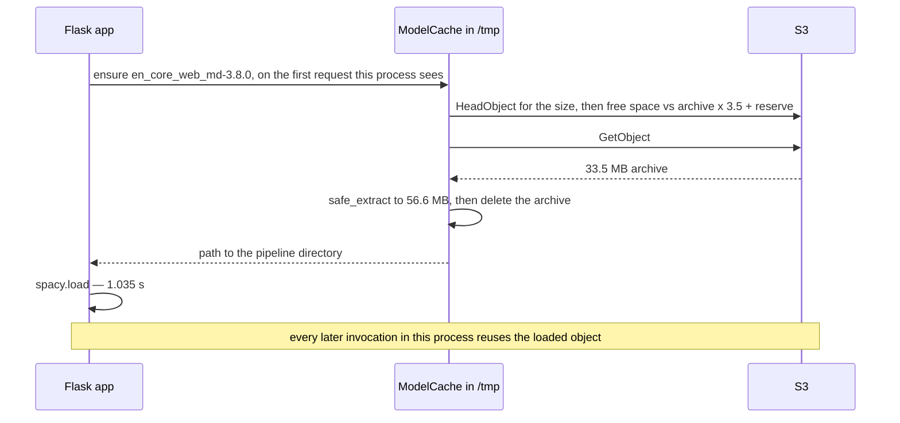

# NLP on Lambda, with the model in S3

A Lambda deployment package may not exceed **250 MB unzipped**. `requirements.txt` takes about
**149 MB** of that before any model exists and `en_core_web_md` unpacked is another **56.6 MB** — it
fits, barely, with nothing spare. Larger does not fit at all: `en_core_web_lg` is **400.6 MB** zipped.

So the model is not in the package. It lives in S3 as a `.tar.gz`, is fetched and unpacked into
`/tmp` on the first invocation a container serves, and is reused by every invocation after that. This
Flask service is what that costs: a pre-flight space check, safe tar extraction, a process memo.

| model | archive | unpacked |
|---|---|---|
| `en_core_web_sm-3.8.0` | 12.8 MB | 15.3 MB |
| `en_core_web_md-3.8.0` | 33.5 MB | 56.6 MB |
| `en_core_web_lg-3.8.0` | 400.6 MB | over the limit while still compressed |

Archive sizes: HTTP HEAD against the spaCy releases, no download. Unpacked: byte counts this service
logs after extracting (15,267,634 / 56,577,245). Dependencies: `du -sm` on a clean virtualenv, 169 MB
installed less ~20 MB of `pip`/`setuptools`. Transcripts: [`docs/captured-output.md`](docs/captured-output.md).

## What a cold container pays



| phase | `en_core_web_sm` | `en_core_web_md` |
|---|---|---|
| fetch + unpack, cold `/tmp` | 0.291 s | 0.466 s |
| `spacy.load` | 0.742 s | 1.035 s |
| **cold total, first document included** | **~1.04 s** | **~1.51 s** |

A new process on a container whose `/tmp` is already populated pays 0.002 s for the disk hit and 0.629 s
for the load; a warm process pays nothing and runs 5.24 ms/document. Note which side is expensive:
`spacy.load` costs more than the transfer here — which brings us to what these numbers are and are not.

## Measured on a laptop over loopback. Never deployed.

Every timing above is from one recorded session (2026-09-24, Apple Silicon laptop) with the S3 API
served by a local [`moto`](https://github.com/getmoto/moto) server on `127.0.0.1` — the real S3 protocol
through the real boto3 download path, and zero network. The fetch figures are a lower bound of *no
transfer cost at all* and the CPU beats a small Lambda's, so they give the **shape** of the cost — paid
once per container, dominated by load — not its magnitude on AWS.

**This service was never deployed to AWS**, so there is deliberately no Lambda latency figure in this
README and no price. The one AWS-side claim is reasoning rather than measurement, and labelled so:
in-region S3-to-Lambda transfer is not billed, so a cold start should cost one `GetObject` — check
current S3 pricing, do not trust that sentence. `POST /warmup` returns `load_seconds` for your own.

## Running it

```bash
docker compose up   # MinIO on 8321 (console 8322), a seeding job, then the API on 8320
```

The seeding job creates the bucket and uploads a real model, because the API is useless without one.

> Status from this repo's own build report, verbatim: **Build verified: NOT RUN — deferred, RAM
> constraint**, **Boot verified: NOT RUN — deferred, RAM constraint**. `docker compose config` was run
> and parses; that is the only Docker verification performed. The stack was authored, not executed.

```bash
python -m venv .venv && source .venv/bin/activate && pip install -r requirements-dev.txt
pytest                                      # 67 tests
MODEL_SOURCE=github MODEL_CACHE_DIR=/tmp/models python -m nlp_lambda.cli warm
MODEL_SOURCE=local LOCAL_MODEL_ROOT=/tmp/models ./run_local.sh
```

No test reaches AWS and none downloads a model — `tests/conftest.py` scrubs credentials from the
environment, S3 is `moto`'s `mock_aws`, pipelines are `spacy.blank("en")` plus an `entity_ruler`
named `ner`, and the suite passes with an empty environment. `pipenv` works too, though the
original `Pipfile` pinned Python 3.8 and `pipenv lock` refuses to start without that interpreter,
so it was rewritten for 3.12 (§6 of the captured output). Deploying is `zappa deploy dev` once
`nlp_lambda.cli download` and `upload` have put a model in the bucket. Every setting is optional
and none is read at import time — `.env.example` lists them with defaults — and `MODEL_SOURCE`
(`s3`, `local`, `github`) picks the adapter, so EFS or an internal artifact store is one class
plus one `register_model_source` line.

## Calling it

```console
$ curl -s -X POST localhost:8320/analyze -H 'Content-Type: application/json' \
    -d '{"text": "Ada Lovelace met Charles Babbage in London."}'
{"analyzer": "entities", "count": 1, "results": [[
  {"text": "Ada Lovelace",    "label": "PERSON", "start_char": 0,  "end_char": 12},
  {"text": "Charles Babbage", "label": "PERSON", "start_char": 17, "end_char": 32},
  {"text": "London",          "label": "GPE",    "start_char": 36, "end_char": 42}]]}
```

`analyzer` is one of `entities`, `locations`, `noun_chunks`; `texts` batches up to `MAX_BATCH_SIZE`
documents through `nlp.pipe`. Each analyzer declares the components it needs and leaves the rest
disabled: over a 32-document, 20,448-character batch, `ner` alone measured **2.47× faster** than the
full pipeline (414.9 ms → 167.7 ms median) — reproduce with `python -m scripts.bench_pipeline`. Also
`GET /health` (touches neither S3 nor the model), `POST /warmup`, and `POST /find_locations`, intact.

## What was wrong with the original code

The git history here was rebuilt, so none of this is checkable from a diff. What *is* checkable is
that every fix carries a docstring at the site naming what it replaced:

* **`find_locations(**json_payload)`** splatted every key of an untrusted request body into a Python
  call, so a typo in a key name was a `TypeError` and a 500 — and `SENTRY_DSN` plus an S3 model load
  happened at *import* time, so the suite could not be collected without AWS credentials. Pinned by
  `test_unexpected_keys_are_a_400_not_a_500`, `test_importing_app_needs_no_env_and_downloads_nothing`.
* **`tarfile.extractall` with no member validation** — CVE-2007-4559, where a member named `../../x`
  writes outside the destination. `archive.safe_extract` checks members *and* link targets first,
  then uses `filter="data"` where the interpreter has it. Pinned by
  `test_path_traversal_member_is_rejected` and `test_absolute_path_member_is_rejected`.
* **`locations_sorted_by_num_appearances` never sorted** — it returned `list(Counter(...).keys())`,
  which is insertion order. It is `most_common()` now. The evidence for the original is the
  docstring on `_locations` in `nlp_lambda/service.py`, not a test: the input in
  `test_locations_are_ranked_by_frequency_not_first_appearance` would pass under insertion order too.

## Known gaps

* **`/tmp` is never evicted** — right for one model, wrong the moment there are two, which is why
  `SPACY_MODEL` is deliberately a single value.
* **`en_core_web_lg` cannot be served here**: over the package limit compressed, and
  `zappa_settings.json` cannot raise Lambda ephemeral storage above the 512 MB `/tmp` default.
* **No confidence scores** — spaCy's default NER does not expose one, and inventing a number would
  be worse — and **no authentication**, which whatever fronts the function is assumed to handle.
* **The pins moved forward and had to**: Python 3.8 → 3.12, spaCy unpinned → `>=3.7,<4`,
  `sentry-sdk==0.16.4` → optional `>=2.0`. No installable spaCy 3 loads the spaCy 2 model names the
  original README used. Only `en_core_web_sm` and `_md` have been exercised, though any archive
  should work.

## Licence

MIT — see [LICENSE](LICENSE).
